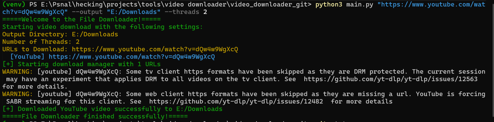

## GrabMEDIA

A command-line tool for downloading videos and images from YouTube and other platforms, with support for parallel and multiple downloads.

## FEATURES:
- YouTube support - Downloads videos and playlists
- Multi-threaded - Parallel downloads with configurable threads
- Audio preservation - Ensures audio tracks are properly merged
- DRM handling - Warns about protected content
- Custom output - Save to any directory

## INSTALLATION:

### Prerequisites:
- Python 3.8+
- FFmpeg (for format conversion)

### Installation commands:
git clone https://github.com/yourusername/video-downloader.git
cd video-downloader
pip install -r requirements.txt

## USAGE:

### Basic command:
python main.py [URL] [OPTIONS]

### Sample output


### Examples: 

#### Download a single video:
```bash
python main.py "https://www.youtube.com/watch?v=dQw4w9WgXcQ" --output "~/Videos"
```

#### Download with 4 parallel threads:
```bash
python main.py "https://youtu.be/example1" "https://youtu.be/example2" -t 4
```

## OPTIONS:
|**Flag**     |  **Description**             |  **Default** |
|-------------|------------------------------|--------------|
|-o, --output |   Output directory           |  ./downloads |
|-t, --threads|   Parallel download threads  |   2          |
```bash
python main.py "URL1" "URL2"  # Downloads one after another
```
```bash
python main.py "URL1" "URL2" "URL3" -t 3  # All 3 download simultaneously, faster
```

## Known Issues
- ⚠️ **DRM-protected videos**: Some YouTube content may not be downloadable due to DRM restrictions
- 📺 **TV client formats**: Certain formats may be skipped (see [yt-dlp#12563](https://github.com/yt-dlp/yt-dlp/issues/12563))
- 🌐 **Web client formats**: Some formats may be missing (see [yt-dlp#12482](https://github.com/yt-dlp/yt-dlp/issues/12482))

## Troubleshooting

**No audio in downloads?**
1. Verify FFmpeg is installed correctly:
   ```bash
   ffmpeg -version
   ```
2. Try different format combinations in `downloader.py`:
   ```python
   'format': 'bestvideo[ext=mp4]+bestaudio[ext=m4a]/best'
   ```

## Dependencies
This project uses:
- [yt-dlp](https://github.com/yt-dlp/yt-dlp) (Unlicense) - YouTube download engine
- [FFmpeg](https://ffmpeg.org/) (LGPL/GPL) - Video processing
- [tqdm](https://github.com/tqdm/tqdm) (MIT) - Progress bars

## License
[MIT_LICENSE](LICENSE)
